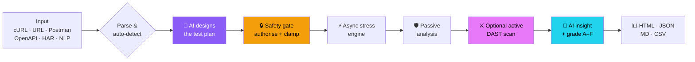
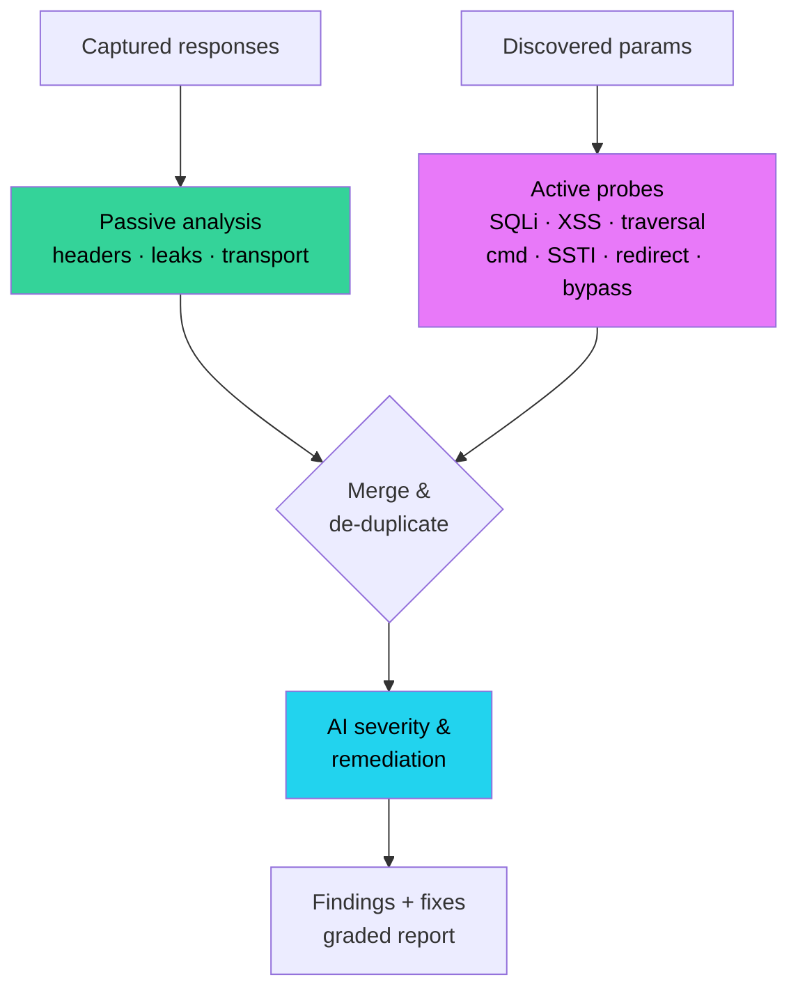
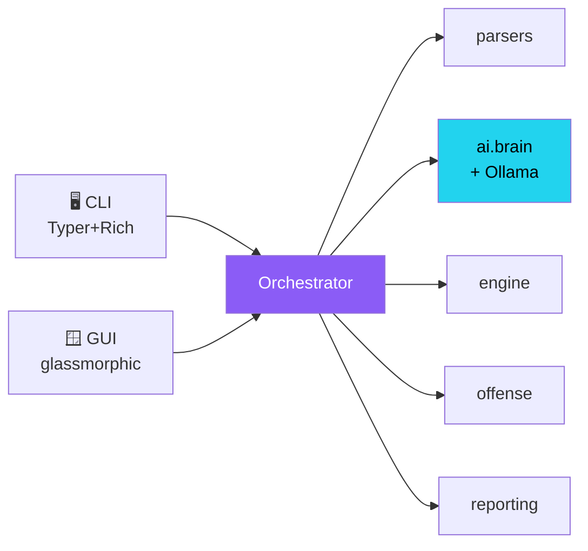

<div align="center">


<h1></h1>

**AI-driven API load-testing &amp; security platform · Offensive + Defensive · Education &amp; Research**

[](https://github.com/BugMeDude/AEGIS)
[](https://www.python.org/)
[](tests/)
[](docs/AI.md)
[](LICENSE)

[**Quick start**](#-quick-start) ·
[**Screenshots**](#-screenshots) ·
[**Use cases**](#-use-cases) ·
[**Workflows**](#-workflows) ·
[**Commands**](#-command-reference) ·
[**Docs**](docs/)

</div>

> ### 🎓 Educational &amp; Research Edition
> AEGIS is built for **students, security researchers and authorised penetration testers** to learn — hands-on — how API **load &amp; resilience** and **injection-class vulnerabilities** (SQLi, XSS, traversal, command/template injection, open redirect, header auth-bypass) actually work, **and how to defend against them**. It pairs an **offensive** active scanner with **defensive** passive analysis and AI remediation.
>
> **Use it ONLY on systems you own or are explicitly authorised to test.** Unauthorised testing is illegal and is solely the user's responsibility. A hard authorization gate + load caps enforce this in code.

---

## ✨ What is AEGIS?

A complete, AI-driven rebuild of the 2024 *Ethical Hacker API Tester*. Point it at a cURL command, URL, Postman collection, OpenAPI spec, HAR file — or just plain English — and AEGIS will **plan**, **stress-test**, **attack (optionally)**, **analyse** and **report**, automatically.

<table>
<tr>
<td width="33%" valign="top">

### ⚡ Stress Engine
Async `asyncio` + `httpx`. Count **and** duration models, RPS pacing, ramp-up, cooperative stop. True **p50/p90/p95/p99**, stdev, throughput.

</td>
<td width="33%" valign="top">

### 🧠 Real AI
Live LLM reasoning via **Ollama `gemma4:31b-cloud`** for planning, NLP, security review &amp; executive insight — with a deterministic **heuristic fallback** so it works 100% offline.

</td>
<td width="33%" valign="top">

### ⚔️ Offensive + 🛡️ Defensive
Bounded active **DAST** scanner (SQLi/XSS/traversal/cmd/SSTI/redirect/bypass) **plus** passive header/leak analysis — every finding paired with remediation.

</td>
</tr>
<tr>
<td valign="top">

### 🤖 Autopilot
Zero-config: the AI designs the whole test plan from your goal, runs it, analyses and grades it **A–F**.

</td>
<td valign="top">

### 🖥️ Modern GUI + CLI
Glassmorphic animated desktop app **and** a Rich-powered CLI with CI-friendly exit codes.

</td>
<td valign="top">

### 📊 Reports
Self-contained **HTML dashboard**, JSON, Markdown, CSV — with charts, grade and AI summary.

</td>
</tr>
</table>

---

## 📸 Screenshots

<div align="center">

### 🖥️ Desktop GUI — glassmorphic, animated, multi-colour


<em>Animated grade gauge · live throughput sparkline · colour-coded AI insight · neon gradient controls</em>

<br/><br/>


<em>Live run — motion, gradient progress shimmer, real-time metrics</em>

<table>
<tr>
<td><br/><div align="center"><em>Latency percentiles &amp; severity charts</em></div></td>
<td><br/><div align="center"><em>Offensive + defensive findings</em></div></td>
</tr>
</table>

### ⌨️ Command line


<em><code>aegis scan</code> — active DAST + AI insight, colour-graded, CI exit codes</em>

<br/>


<em><code>aegis doctor</code> — environment, live Ollama model &amp; safety policy</em>

</div>

---

## 🚀 Quick start

```bash
git clone https://github.com/BugMeDude/AEGIS.git
cd AEGIS
python3 -m pip install -r requirements.txt
# optional: install the `aegis` command globally
python3 -m pip install -e .
```

> Full AI needs a local [Ollama](https://ollama.com) running `gemma4:31b-cloud`.
> No Ollama? AEGIS auto-falls back to its deterministic engine — everything still works.

```bash
# Launch the desktop GUI
python3 -m aegis gui

# Health check (Python · Ollama · policy)
python3 -m aegis doctor

# Fully automated — AI plans, runs, analyses
python3 -m aegis autopilot "http://127.0.0.1:8000/api" --goal baseline

# Offensive + defensive vulnerability scan (education / authorised research)
python3 -m aegis scan "http://127.0.0.1:8000/item?id=1"

# Natural language
python3 -m aegis ai "stress https://lab.local for 30s, 50 concurrent" --authorized
```

`./aegis.sh <cmd>` is a convenience wrapper. Input can be a literal string, a file, or `-` (stdin).

---

## 🎯 Use cases

| For | Scenario | Command |
|---|---|---|
| 🎓 **Students** | See how p95 latency degrades under concurrency | `aegis run api.curl -n 100 -d 30` |
| 🔬 **Researchers** | Study injection detection on a deliberately-vulnerable lab | `aegis scan "http://lab.local/q?id=1"` |
| 🛡️ **AppSec / pentest** | Authorised API assessment with remediation report | `aegis run openapi.yaml -O --authorized --formats html` |
| ⚙️ **CI/CD** | Fail the build on a security regression (exit code 4) | `aegis scan spec.json --authorized --no-save` |
| 🤖 **SRE / perf** | Let the AI design a soak/spike test from a goal | `aegis autopilot https://svc/health --goal "soak test"` |
| 💬 **Quick check** | Drive a test in plain English | `aegis ai "hit https://x/api 500 times, 20 concurrent"` |

---

## 🔁 Workflows

### Autopilot — fully automated



### Offensive + defensive security pipeline



### Architecture (one pipeline, two front-ends)



---

## 📖 Command reference

| Command | Purpose |
|---|---|
| `aegis doctor` | Environment, Ollama &amp; policy health check |
| `aegis plan <input>` | Show the AI-proposed plan only (no traffic) |
| `aegis run <input>` | Load + security test with **your** plan |
| `aegis autopilot <input>` | Fully automated — AI plans, runs, analyses |
| `aegis scan <input>` | **Offensive + defensive** active DAST scan |
| `aegis ai "<sentence>"` | Natural-language driven test |
| `aegis report <file.json>` | Re-render a saved report to HTML/MD/CSV |
| `aegis init` | Write an example `aegis.yaml` |
| `aegis gui` | Launch the desktop app |

Key flags: `-n` concurrency · `-d` duration(s) · `-r` requests · `--rps` · `--ramp` · `-O/--offensive` · `--ai-plan` · `--authorized` · `--no-ai` · `--formats`.

<details>
<summary><b>Exit codes (CI-friendly)</b></summary>

| Code | Meaning |
|---|---|
| 0 | Success, no High/Critical findings |
| 1 | Runtime error |
| 2 | No requests parsed from input |
| 3 | Refused by responsible-use policy |
| 4 | Completed, but a **High/Critical** finding exists |

</details>

---

## 🔒 Responsible use &amp; configuration

AEGIS **refuses to generate load or probes against any non-local host** unless you affirm authorization (`--authorized`, `safety.authorized: true`, or `AEGIS_AUTHORIZED=1`). Concurrency, duration and request **caps** are always enforced. Host **allow/block lists** are supported.

```bash
python3 -m aegis init      # writes a commented aegis.yaml
```

```yaml
ollama:   { model: "gemma4:31b-cloud", fallback_model: "gemma4:latest", enabled: true }
safety:   { authorized: false, max_concurrency: 250, max_duration_seconds: 600,
            allowlist: [], blocklist: [] }
report_dir: "aegis_reports"
```

---

## 🧪 Testing

```bash
python3 -m pytest -q          # 45 tests · ~10s · offline & deterministic
```

Spins up real local HTTP servers (one deliberately vulnerable) and exercises the async engine, parsers, safety gate, reporting, the heuristic AI path **and** the offensive scanner's detectors end-to-end.

---

## 📚 Documentation

| Doc | Contents |
|---|---|
| [docs/USAGE.md](docs/USAGE.md) | Every command, flag &amp; workflow |
| [docs/SECURITY.md](docs/SECURITY.md) | Offensive + defensive module, responsible use |
| [docs/ARCHITECTURE.md](docs/ARCHITECTURE.md) | Module map &amp; data flow |
| [docs/AI.md](docs/AI.md) | The AI layer, prompts, fallback model |
| [CHANGELOG.md](CHANGELOG.md) | Full rebuild changelog |

---

<div align="center">

**AEGIS v2.0.0** · Built by **BugMeDude** · MIT License

*Brand assets are generated deterministically — see [`assets/make_logo.py`](assets/make_logo.py) and [`scripts/`](scripts/).*

🎓 *For education &amp; authorised security research only.*

</div>
