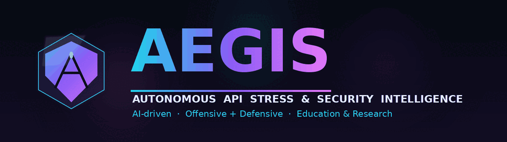
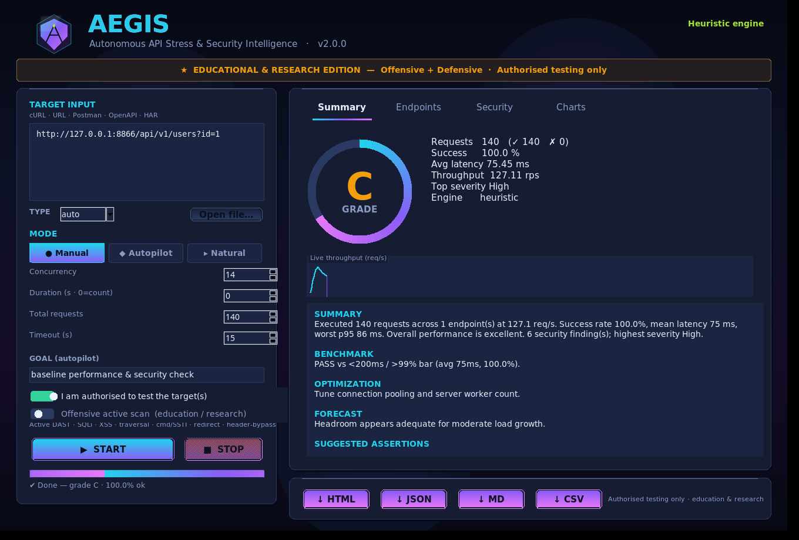
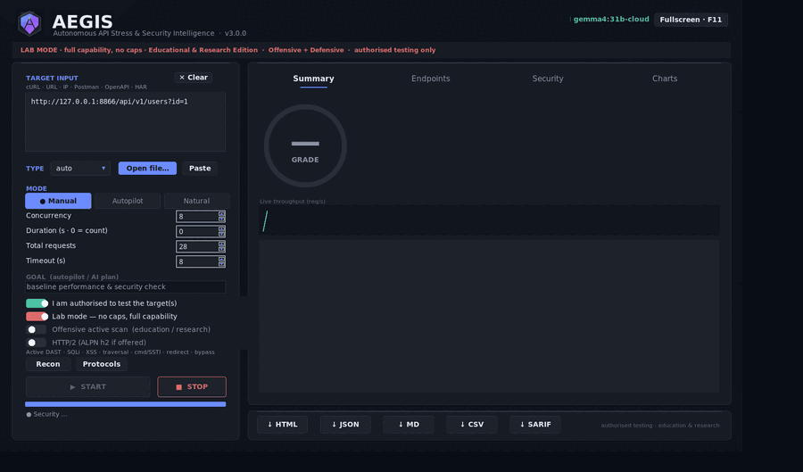
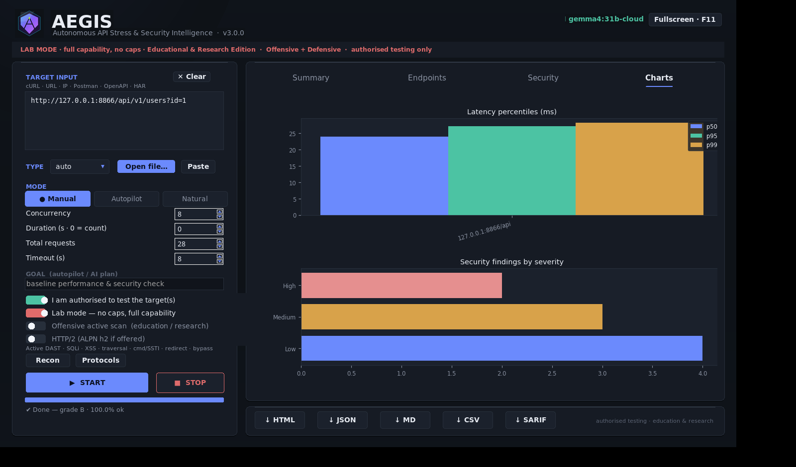
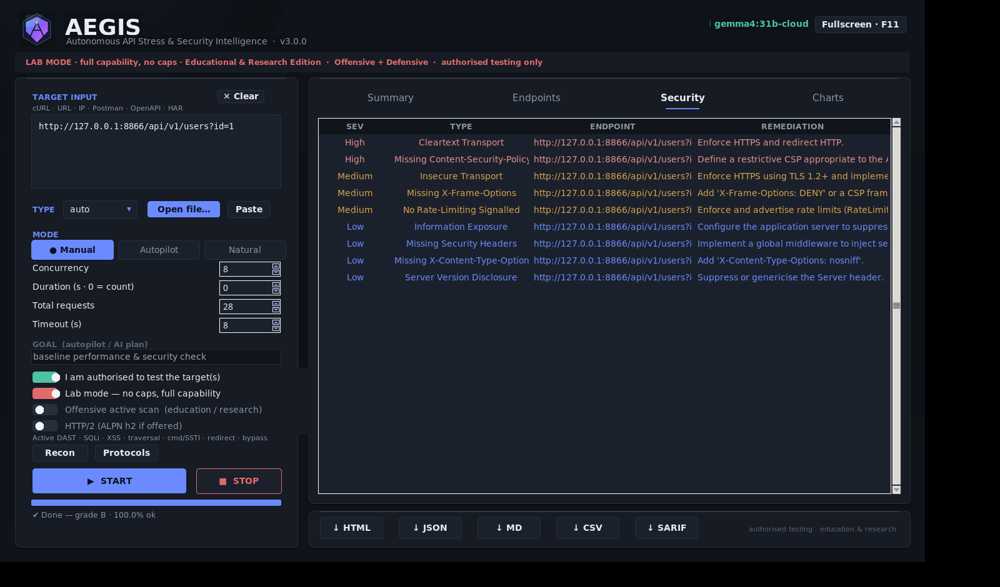
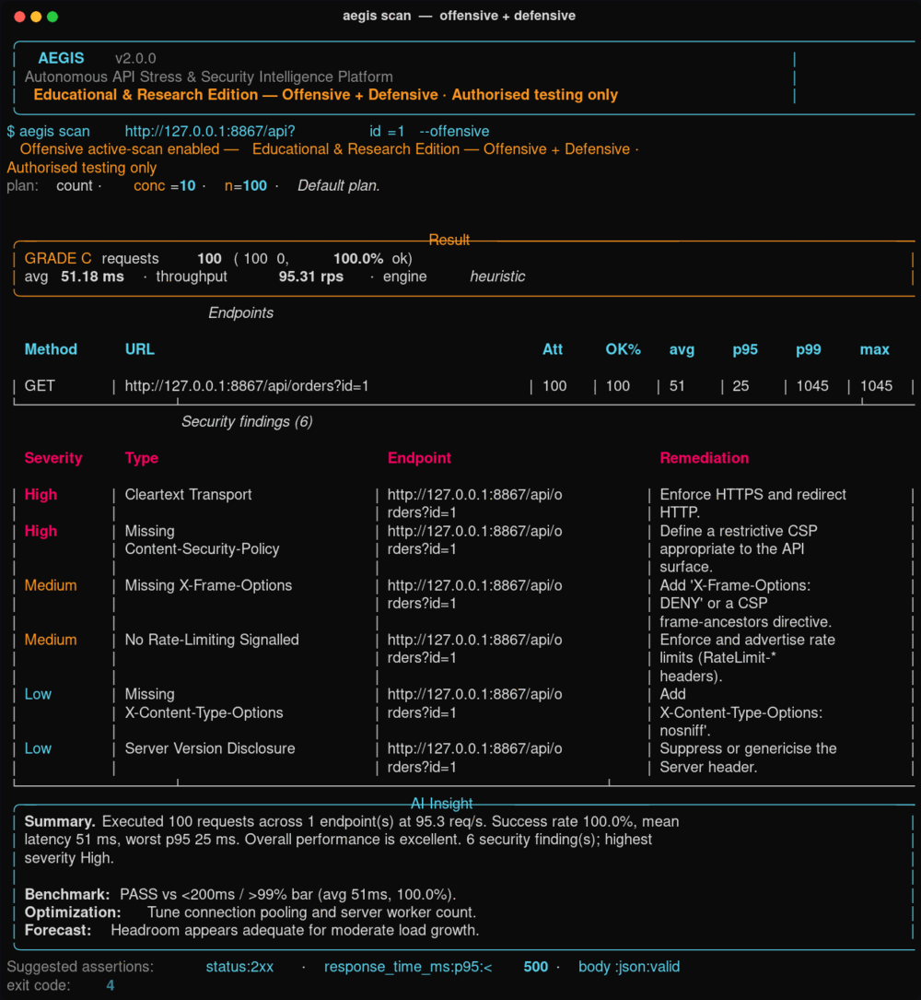
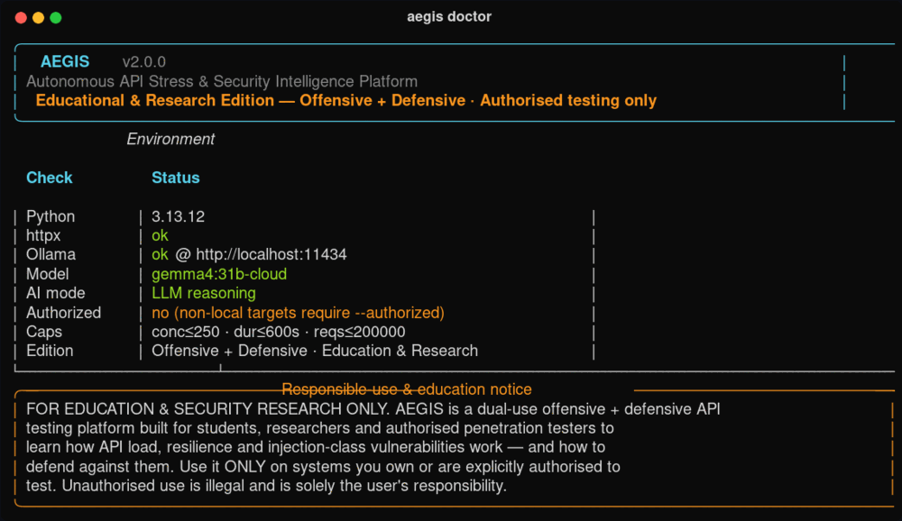
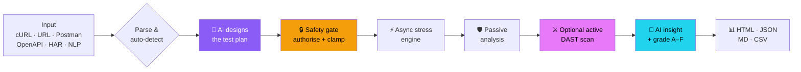
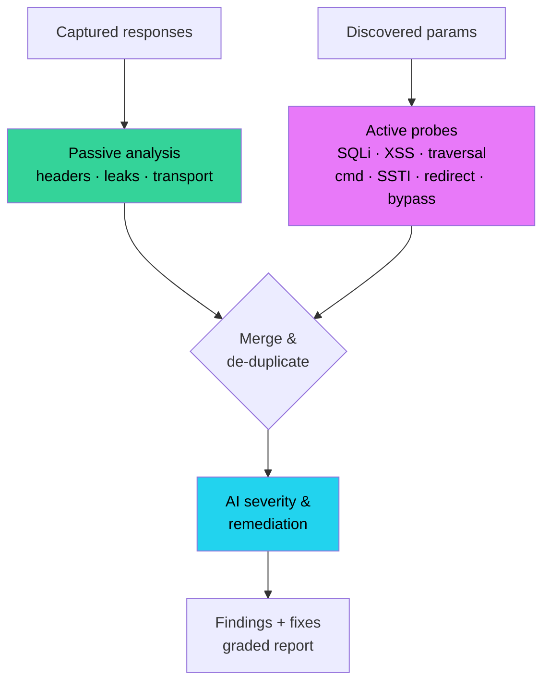
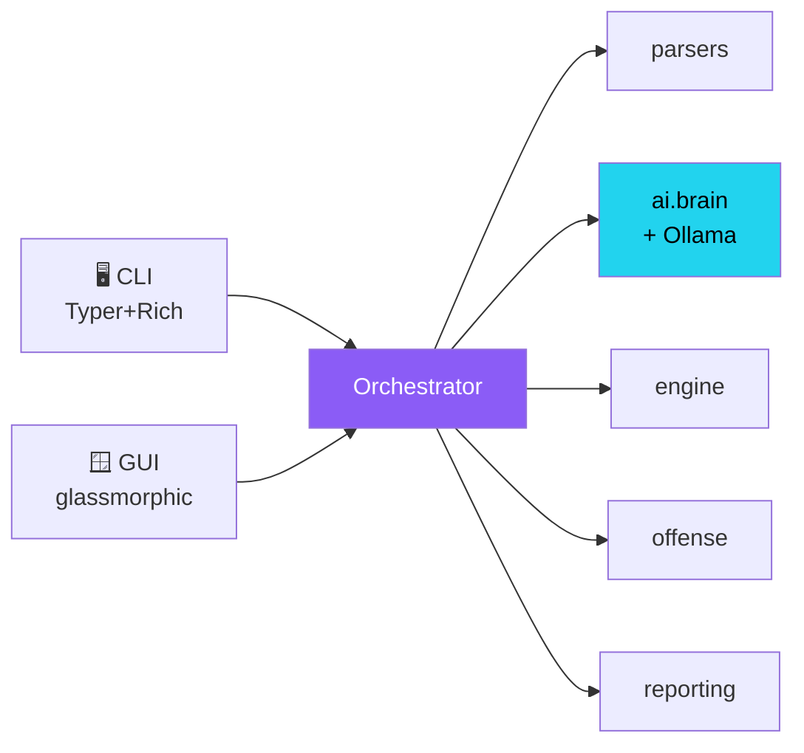

<div align="center">



<h1></h1>

**AI-driven API load-testing &amp; security platform · Offensive + Defensive · Education &amp; Research**

[](https://github.com/BugMeDude/AEGIS)
[](https://www.python.org/)
[](tests/)
[](docs/AI.md)
[](LICENSE)

[**Quick start**](#-quick-start) ·
[**Screenshots**](#-screenshots) ·
[**Use cases**](#-use-cases) ·
[**Workflows**](#-workflows) ·
[**Commands**](#-command-reference) ·
[**Docs**](docs/)

</div>

> ### 🎓 Educational &amp; Research Edition
> AEGIS is built for **students, security researchers and authorised penetration testers** to learn — hands-on — how API **load &amp; resilience** and **injection-class vulnerabilities** (SQLi, XSS, traversal, command/template injection, open redirect, header auth-bypass) actually work, **and how to defend against them**. It pairs an **offensive** active scanner with **defensive** passive analysis and AI remediation.
>
> **Use it ONLY on systems you own or are explicitly authorised to test.** Unauthorised testing is illegal and is solely the user's responsibility. A hard authorization gate + load caps enforce this in code.

---

## ✨ What is AEGIS?

A complete, AI-driven rebuild of the 2024 *Ethical Hacker API Tester*. Point it at a cURL command, URL, Postman collection, OpenAPI spec, HAR file — or just plain English — and AEGIS will **plan**, **stress-test**, **attack (optionally)**, **analyse** and **report**, automatically.

<table>
<tr>
<td width="33%" valign="top">

### ⚡ Stress Engine
Async `asyncio` + `httpx`. Count **and** duration models, RPS pacing, ramp-up, cooperative stop. True **p50/p90/p95/p99**, stdev, throughput.

</td>
<td width="33%" valign="top">

### 🧠 Real AI
Live LLM reasoning via **Ollama `gemma4:31b-cloud`** for planning, NLP, security review &amp; executive insight — with a deterministic **heuristic fallback** so it works 100% offline.

</td>
<td width="33%" valign="top">

### ⚔️ Offensive + 🛡️ Defensive
Bounded active **DAST** scanner (SQLi/XSS/traversal/cmd/SSTI/redirect/bypass) **plus** passive header/leak analysis — every finding paired with remediation.

</td>
</tr>
<tr>
<td valign="top">

### 🤖 Autopilot
Zero-config: the AI designs the whole test plan from your goal, runs it, analyses and grades it **A–F**.

</td>
<td valign="top">

### 🖥️ Modern GUI + CLI
Glassmorphic animated desktop app **and** a Rich-powered CLI with CI-friendly exit codes.

</td>
<td valign="top">

### 📊 Reports
Self-contained **HTML dashboard**, JSON, Markdown, CSV — with charts, grade and AI summary.

</td>
</tr>
</table>

---

## 📸 Screenshots

<div align="center">

### 🖥️ Desktop GUI — calm frosted glass, responsive (v3 controls: HTTP/2, Recon, Protocols, SARIF)



<em>Animated grade gauge · live throughput sparkline · colour-coded AI insight · neon gradient controls</em>

<br/><br/>



<em>Live run — motion, gradient progress shimmer, real-time metrics</em>

<table>
<tr>
<td><br/><div align="center"><em>Latency percentiles &amp; severity charts</em></div></td>
<td><br/><div align="center"><em>Offensive + defensive findings</em></div></td>
</tr>
</table>

### ⌨️ Command line



<em><code>aegis scan</code> — active DAST + AI insight, colour-graded, CI exit codes</em>

<br/>



<em><code>aegis doctor</code> — environment, live Ollama model &amp; safety policy</em>

</div>

---

## 🚀 Quick start

```bash
git clone https://github.com/BugMeDude/AEGIS.git
cd AEGIS
python3 -m pip install -r requirements.txt
# optional: install the `aegis` command globally
python3 -m pip install -e .
```

> Full AI needs a local [Ollama](https://ollama.com) running `gemma4:31b-cloud`.
> No Ollama? AEGIS auto-falls back to its deterministic engine — everything still works.

```bash
# Launch the desktop GUI
python3 -m aegis gui

# Health check (Python · Ollama · policy)
python3 -m aegis doctor

# Fully automated — AI plans, runs, analyses
python3 -m aegis autopilot "http://127.0.0.1:8000/api" --goal baseline

# Offensive + defensive vulnerability scan (education / authorised research)
python3 -m aegis scan "http://127.0.0.1:8000/item?id=1"

# Natural language
python3 -m aegis ai "stress https://lab.local for 30s, 50 concurrent" --authorized
```

`./aegis.sh <cmd>` is a convenience wrapper. Input can be a literal string, a file, or `-` (stdin).

---

## 🎯 Use cases

| For | Scenario | Command |
|---|---|---|
| 🎓 **Students** | See how p95 latency degrades under concurrency | `aegis run api.curl -n 100 -d 30` |
| 🔬 **Researchers** | Study injection detection on a deliberately-vulnerable lab | `aegis scan "http://lab.local/q?id=1"` |
| 🛡️ **AppSec / pentest** | Authorised API assessment with remediation report | `aegis run openapi.yaml -O --authorized --formats html` |
| ⚙️ **CI/CD** | Fail the build on a security regression (exit code 4) | `aegis scan spec.json --authorized --no-save` |
| 🤖 **SRE / perf** | Let the AI design a soak/spike test from a goal | `aegis autopilot https://svc/health --goal "soak test"` |
| 💬 **Quick check** | Drive a test in plain English | `aegis ai "hit https://x/api 500 times, 20 concurrent"` |

---

## 🔁 Workflows

### Autopilot — fully automated



### Offensive + defensive security pipeline



### Architecture (one pipeline, two front-ends)



---

## 📖 Command reference

| Command | Purpose |
|---|---|
| `aegis doctor` | Environment, Ollama &amp; policy health check |
| `aegis plan <input>` | Show the AI-proposed plan only (no traffic) |
| `aegis run <input>` | Load + security test with **your** plan |
| `aegis autopilot <input>` | Fully automated — AI plans, runs, analyses |
| `aegis scan <input>` | **Offensive + defensive** active DAST scan |
| `aegis ai "<sentence>"` | Natural-language driven test |
| `aegis recon <target>` | Fingerprint · endpoint/param discovery · schema |
| `aegis protocols <target>` | **v3** HTTP/2 · WebSocket · gRPC probe (observe only) |
| `aegis validate <report.json>` | **v3** bounded proof-of-impact (EXPERT tier) |
| `aegis assess <targets…>` | **v3** scoped multi-target assessment (explicit only) |
| `aegis campaign <target>` | **v3** autonomous agentic campaign |
| `aegis repl` | **v3** interactive console |
| `aegis report <file.json>` | Re-render a saved report (HTML/MD/CSV/SARIF) |
| `aegis init` | Write an example `aegis.yaml` |
| `aegis gui` | Launch the desktop app |

Key flags: `-n` concurrency · `-d` duration(s) · `-r` requests · `--rps` · `--ramp` · `--http2` · `-O/--offensive` · `--ai-plan` · `--ai-payloads` · `--authorized` · `--lab` · `--no-ai` · `--formats` (json,html,md,csv,**sarif**) · `-t/--type` · `-c/--config`.

<details>
<summary><b>Exit codes (CI-friendly)</b></summary>

| Code | Meaning |
|---|---|
| 0 | Success, no High/Critical findings |
| 1 | Runtime error |
| 2 | No requests parsed from input |
| 3 | Refused by responsible-use policy |
| 4 | Completed, but a **High/Critical** finding exists |

</details>

---

## 🧬 v3 advanced capabilities (Phase 4.2 & 6)

### Protocols — HTTP/2 · WebSocket · gRPC  *(observe only)*

```bash
# Detect HTTP/2 (ALPN h2), WebSocket behaviour, gRPC reflection/hint
python3 -m aegis protocols https://api.lab.local
python3 -m aegis protocols 10.0.0.5:8080 --timeout 6

# Drive the load engine over HTTP/2
python3 -m aegis run https://api.lab.local -n 50 -r 2000 --http2 --lab
python3 -m aegis autopilot https://api.lab.local --http2 --lab
```

`protocols` is pure observation (negotiated version, a few bounded WebSocket
edge-frames, gRPC reflection when `grpcio` is present, else an HTTP/2 hint).
The **HTTP/2** toggle and **Protocols**/**Recon** buttons are in the GUI too.

### Proof-of-impact validation  *(Phase 6.1 — bounded, EXPERT-gated)*

```bash
# Confirms an already-found SQLi/XSS is real — a few probes, NO data dump.
# Requires EXPERT auth tier + budget; refuses otherwise.
python3 -m aegis validate aegis_reports/aegis_report_*.json --lab
```

> Hard-capped at **4 probes per finding**. It confirms exploitability
> (boolean differential / single version banner / reflected marker) and
> **never** enumerates or dumps tables, columns or rows — by design and
> enforced in code, per the project's risk-mitigation policy.

### Scoped assessment  *(Phase 6.2 — explicit targets only)*

```bash
# Assess additional targets you EXPLICITLY list and are authorised for.
python3 -m aegis assess https://api.lab.local 10.0.0.5:8080 https://b.lab.local --lab
```

> Each target is independently re-authorised through the safety gate. There
> is **no** auto-pivot from a compromise, **no** SSH tunnelling, **no**
> lateral movement and **no** persistence — intentionally.

### Reports → SARIF 2.1.0

```bash
python3 -m aegis scan https://api.lab.local --formats json,html,sarif --lab
python3 -m aegis report aegis_reports/aegis_report_*.json --formats sarif
```

SARIF imports into GitHub code-scanning, DefectDojo, Azure DevOps, etc. The
GUI exposes a **↓ SARIF** export button.

---

## 📚 Detailed examples (cookbook)

> Use `python3 -m aegis …` everywhere, or just `aegis …` after
> `pip install -e .`. Input may be a literal string, a **file**, or `-` (stdin).
> Bare hosts/IPs work too — `http://` is assumed (`127.0.0.1:8000`,
> `api.example.com/v1`).

<details open>
<summary><b>Health, planning &amp; config</b></summary>

```bash
aegis doctor                                   # env, Ollama model, policy/mode
aegis init                                     # write a commented aegis.yaml
aegis plan "https://api.example.com" --goal "soak test"   # AI plan, NO traffic
aegis plan collection.json -t postman --no-ai             # heuristic plan only
aegis version
```
</details>

<details open>
<summary><b>Load / stress (you control the plan)</b></summary>

```bash
# Count model: 5000 requests at 50 concurrency
aegis run "https://api.lab.local/health" -n 50 -r 5000 --lab

# Duration model: hold 30 concurrency for 60s with a 5s ramp-up
aegis run api.json -t postman -n 30 -d 60 --ramp 5 --lab

# Throttled to ~200 req/s, custom timeout, save HTML+JSON
aegis run "10.0.0.20:8080/api" -n 40 -r 4000 --rps 200 --timeout 20 \
          --formats html,json

# Let the AI design the plan from a goal instead of the numbers
aegis run openapi.yaml -t openapi --ai-plan --goal "find the breaking point" --lab

# From stdin / a cURL file
cat req.curl | aegis run - -t curl --lab
aegis run requests.curl -O --lab           # + offensive scan
```
</details>

<details open>
<summary><b>Autopilot — fully automated (AI plans → runs → analyses)</b></summary>

```bash
aegis autopilot "https://api.lab.local/v1" --goal "baseline" --lab
aegis autopilot postman.json -t postman --goal "spike test" -O --lab
aegis autopilot "10.0.0.5:9000" --goal "soak test" --formats html,md,json --lab
```
</details>

<details open>
<summary><b>Offensive + defensive scan (education / authorised research)</b></summary>

```bash
# Dedicated active DAST + passive analysis + AI severity/remediation
aegis scan "https://app.lab.local/item?id=1" --lab
aegis scan "http://127.0.0.1:8000/search?q=test" -r 20 -n 5
aegis scan openapi.yaml -t openapi --lab --formats html

# Bolt an active scan onto any run/autopilot with -O / --offensive
aegis run  api.har -t har -O --lab
aegis autopilot "https://api.lab.local" -O --goal "stress test" --lab
```
</details>

<details open>
<summary><b>Natural language</b></summary>

```bash
aegis ai "stress https://api.lab.local for 30 seconds with 50 concurrent" --lab
aegis ai "hit 10.0.0.5:8080/api 500 times, 20 in parallel" --lab
aegis ai "soak https://svc.lab.local for 2 minutes" --lab
```
</details>

<details>
<summary><b>Reports, CI &amp; automation</b></summary>

```bash
# Re-render a saved JSON report to HTML/Markdown/CSV
aegis report aegis_reports/aegis_report_*.json --formats html,md

# CI gate: non-zero (4) exit on a High/Critical finding
aegis scan openapi.yaml -t openapi --lab --no-save || code=$?
[ "${code:-0}" -eq 4 ] && { echo "Security regression"; exit 1; }

# Schedule a nightly authorised scan
echo '0 2 * * * cd /opt/AEGIS && python3 -m aegis scan https://api.lab.local --lab' | crontab -
```
</details>

---

## 🧪 Authorised public test targets

These sites are **intentionally vulnerable and explicitly published for
security testing &amp; education** — legal to test. Great for learning AEGIS:

| Target | What it is |
|---|---|
| `http://testphp.vulnweb.com/listproducts.php?cat=1` | Acunetix PHP test app (SQLi/XSS) |
| `http://rest.vulnweb.com` | Acunetix **vulnerable REST API** |
| `http://testhtml5.vulnweb.com` · `http://testasp.vulnweb.com` | Acunetix test apps |
| `http://demo.testfire.net` | IBM *AltoroMutual* demo bank |
| `https://juice-shop.herokuapp.com` | OWASP **Juice Shop** |
| `https://public-firing-range.appspot.com` | Google **Firing Range** (XSS) |
| `https://httpbin.org/get` | HTTP echo — ideal for pure load tests |

```bash
aegis scan "http://testphp.vulnweb.com/listproducts.php?cat=1" -r 15 --lab
aegis autopilot "http://rest.vulnweb.com" --goal "baseline" --lab
```

> Only ever test these specific authorised sandboxes or systems **you own /
> are contracted to assess**. Keep the load modest — they are shared
> community resources.

---

## 🔒 Responsible use, lab mode &amp; configuration

**Default (safe).** A fresh clone **refuses to generate load or probes
against any non-local host** unless you affirm authorization (`--authorized`,
`safety.authorized: true`, or `AEGIS_AUTHORIZED=1`). Concurrency / duration /
request **caps** apply, and **allow/block lists** are honoured. Loopback and
**private RFC1918** ranges (`10.x`, `172.16–31.x`, `192.168.x`, `localhost`,
`*.local`) are always treated as your lab — zero friction.

**Lab mode (full capability).** In an isolated, fully-authorised lab, enable
**lab mode** to waive the authorization prompt **and all caps** — full
offensive capability, no restrictions:

```bash
aegis scan https://app.lab.local --lab          # per-run flag
export AEGIS_LAB_MODE=1                          # whole shell/session
```
…or persist it in `aegis.yaml` (this file is **git-ignored**, so your machine
runs unrestricted by default while the public repo default stays safe):

```bash
python3 -m aegis init      # writes a commented aegis.yaml
```

```yaml
ollama: { model: "gemma4:31b-cloud", fallback_model: "gemma4:latest", enabled: true }
safety:
  lab_mode: true            # no auth prompt, NO caps, full capability
  authorized: true
  allowlist: []
  blocklist: []
report_dir: "aegis_reports"
```

The GUI exposes the same: **Lab mode** toggle, **Authorised** toggle,
**Fullscreen · F11** (Esc to exit), right-click **Cut/Copy/Paste/Clear** in
the input, and **Open file…** for any cURL/URL-list/Postman/OpenAPI/HAR file.

---

## 🧪 Testing

```bash
python3 -m pytest -q          # 66 tests · ~10s · offline & deterministic
```

Spins up real local HTTP servers (one deliberately vulnerable) and exercises the async engine, parsers, safety gate, reporting, the heuristic AI path **and** the offensive scanner's detectors end-to-end.

---

## 📚 Documentation

| Doc | Contents |
|---|---|
| [docs/USAGE.md](docs/USAGE.md) | Every command, flag &amp; workflow |
| [docs/SECURITY.md](docs/SECURITY.md) | Offensive + defensive module, responsible use |
| [docs/ARCHITECTURE.md](docs/ARCHITECTURE.md) | Module map &amp; data flow |
| [docs/AI.md](docs/AI.md) | The AI layer, prompts, fallback model |
| [CHANGELOG.md](CHANGELOG.md) | Full rebuild changelog |

---

<div align="center">

**AEGIS v2.0.0** · Built by **BugMeDude** · MIT License

*Brand assets are generated deterministically — see [`assets/make_logo.py`](assets/make_logo.py) and [`scripts/`](scripts/).*

🎓 *For education &amp; authorised security research only.*

</div>
